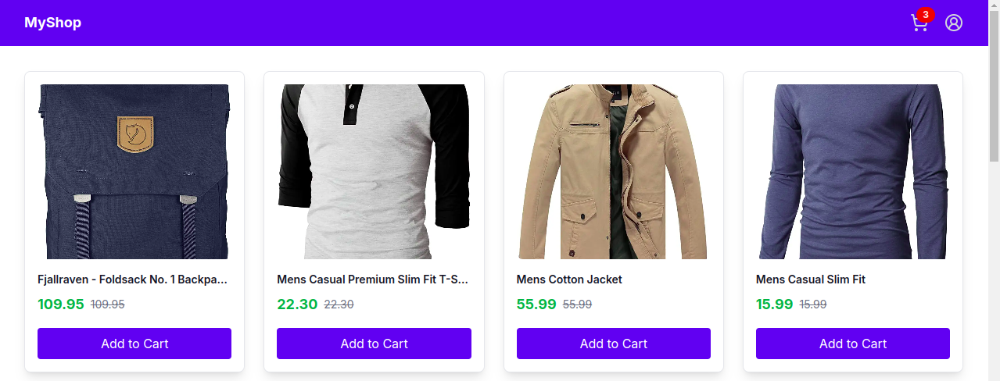
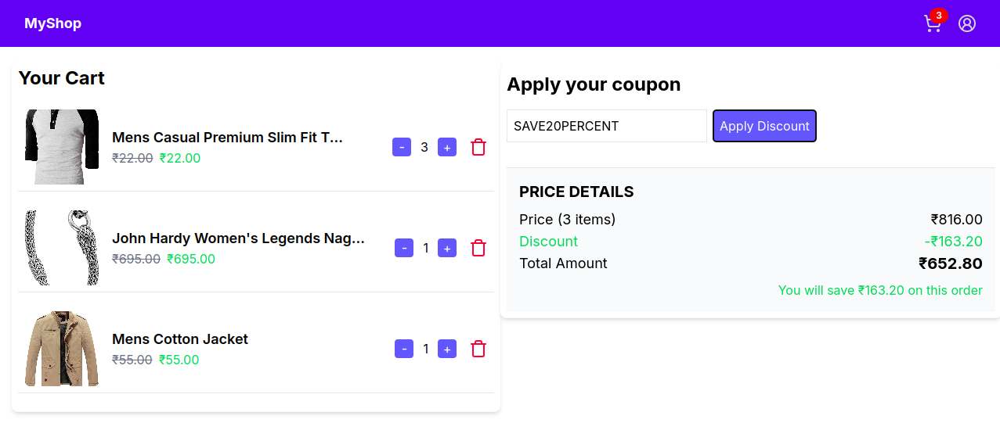

# E-Commerce Shopping Cart Application

This is a feature-rich e-commerce shopping cart application built using **Next.js** (React) with **Tailwind CSS** for styling. The application showcases products, allows users to add items to a virtual cart, manage their cart contents, and apply discounts. This project demonstrates key e-commerce functionalities with a clean and responsive user interface.

## Features

### Product Listing Page

- Displays a grid of products with the following details:
  - Product Image
  - Product Name
  - Product Price (formatted for currency)
  - "Add to Cart" Button
- Shows a cart icon or counter to reflect the number of added items.
- Displays a loading skeleton screen for product.



### Add to Cart Functionality

- Clicking the "Add to Cart" button:
  - Adds the product to the user's virtual shopping cart.
  - Provides visual feedback confirming the item's addition.

### Cart Page

- A dedicated cart page that allows users to manage their selected products:

  - List of added products showing:
    - Product Image
    - Product Name
    - Product Price
    - Quantity Selector (plus/minus buttons)
    - "Remove Item" Button to delete a product from the cart.
  - Cart Summary Section:

    - **Price**: Total cost of all items based on quantity and price.
    - **Discounts**: Ability to apply fixed or percentage-based discounts.
    - **Total Price**: Final amount the user needs to pay after applying discounts.



## Technical Specifications

### Frontend Framework

- **React.js** with **Next.js**

### Styling

- **Tailwind CSS** for responsive and modern design.

### Data Source

- **Fake Store API**: API to fetch product data dynamically.

### Additional Features

- Error handling for invalid quantity inputs or discount codes.
- Persistent cart storage across sessions.

## Installation and Setup

1. **Clone the repository**:

   ```bash
   git clone https://github.com/SAchu47/e-commerce-shopping-cart
   cd e-commerce-shopping-cart

   ```

2. **Install project dependencies**:

   ```bash
   npm i

   ```

3. **Run the project**:

   ```bash
   npm run dev

   ```

## Project Structure

```bash
.
├── components
│   ├── CartItem.tsx               # Reusable cart item component
│   ├── ProductCard.tsx            # Reusable product card component
│   ├── ProductCardSkeleton.tsx    # Reusable skeleton product card component
│   ├── Navbar.tsx                 # Reusable navbar component
├── app
│   ├── page.tsx                   # Product listing page
│   ├── cart
│       ├── page.tsx               # Cart management page
├── public
│   ├── products.json              # Local JSON data for products (if using Option 1)
├── store
│   ├── cartSlice.ts               # Redux slice for managing cart state
│   ├── productsSlice.ts           # Redux slice for managing product data
│   ├── reduc-provider.tsx         # Redux provider for passing the data to the app
│   ├── store.ts                   # Redux store setup
├── styles
│   ├── globals.css                # Global styles using Tailwind CSS
└── README.md                      # Project documentation
```
